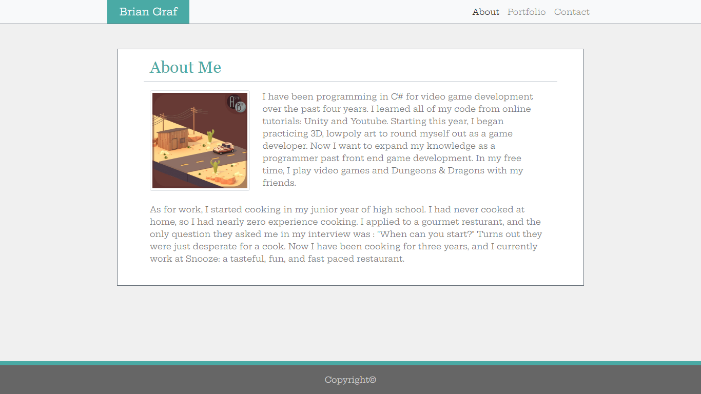
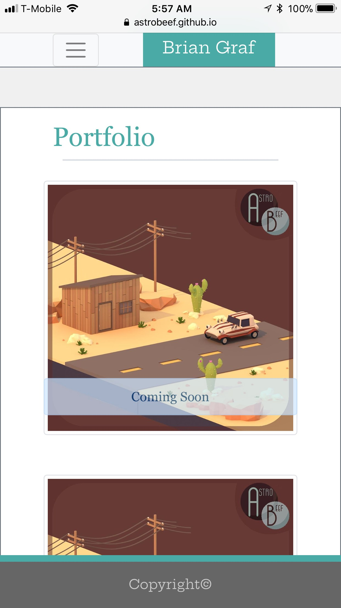

# Responsive-Portfolio-w-Bootstrap
Recreating my portfolio using Twitter Bootstrap

### Table of Contents
- [Description](#Description)
- [Technologies](#Technologies)
- [Languages-Used](#Languages-Used)
- [Screenshots](#Screenshots)
- [Link](#Link)
​
### Description

I recreated my portfolio from the first homework assignment, but this time I used [Twitter-Bootstrap](https://getbootstrap.com).  This allowed me to make a mobile responsive website using premade, modular CSS.  This required an understanding of CSS, but less mastery.  Although, I did use some custom CSS in situations which required it.  If I aim to become a front-end developer, then I would want to study Bootstrap and learn how all of it works, so I may modify it where I need to.  If I want to be a back-end developer, then a basic understanding of Bootsrap is satisfactory.

### Technologies

- [Bootstrap](https://getbootstrap.com/) - CSS Framework
- [Flexbox](https://developer.mozilla.org/en-US/docs/Learn/CSS/CSS_layout/Flexbox) - Resource used within Bootstrap

### Languages Used

- HTML
- CSS

### Screenshots

 

 

### Links

Deployed Webpage

https://astrobeef.github.io/Responsive-Portfolio-w-Bootstrap/index.html
